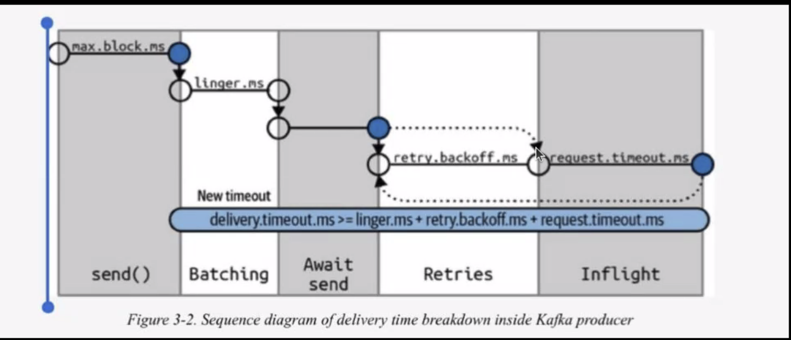
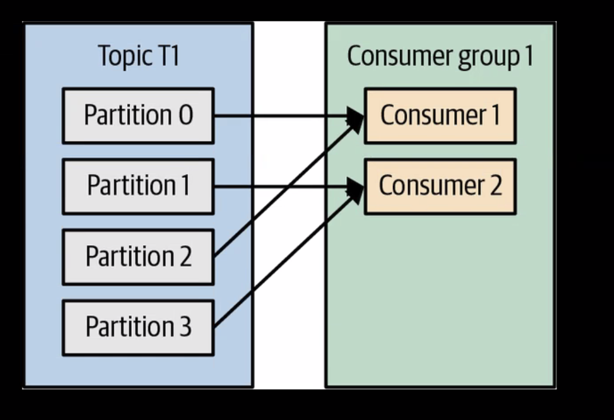
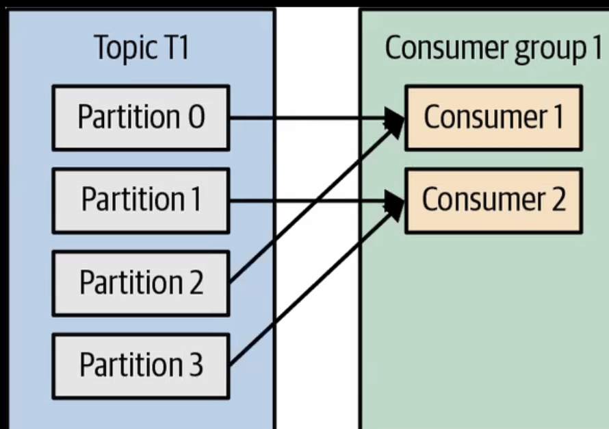
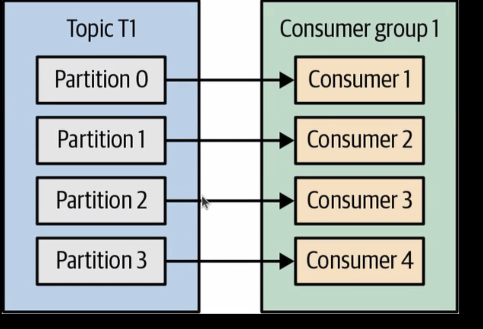

# kafka-training
Java based training in order to learn about Kafka

# Concepts
* batch: (batch of messages)
* schema: how messages are stored in Kafka
* topic: the place where messages are stored (similar to a table in db)
* partitions: (of topics)
* broker: a kafka instance (a machine were kafka is running)
* cluster: one or more brokers working as a single unit

# Requirements:
- jdk11
- [kafka binaries](https://kafka.apache.org/downloads) 
- [kafdrop](https://github.com/obsidiandynamics/kafdrop) (not necessary but useful)

# Installation & configuration
## Kafka installation
Simply unzip the `kafka binaries` and make sure you have the `jdk11` installed and properly configured.

## Kafka configuration
Go to the folder where you unzipped Kafka binaries and modify the following files:
```
- config/zookeeper.properties
- config/server.properties
```
In the `zookeeper` file specify a `clientPort` and make sure you set the flag `admin.enableServer` to `true` (don't forget to specify a `serverPort`).

In the `server` file make sure the `zookeeper.connect` matches the `clientPort` defined in the **zookeeper** file.

## Run kafka and zookeeper
Once we are done with the the conf files, run:
```
bin/zookeeper-server-start.sh config/zookeeper.properties
bin/kafka-server-start.sh config/server.properties
```

Now you can go to http://localhost:8080/

## Kafdrop
Download the newest .jar from its repository and modify the `kafdrop.sh` file to your own needs (in this case it will be listening at the `9092` and the client will be accessible via the `9009` port).

To run the kafdrop client simply execute:
```
sh kafdrop.sh
```
and proceed to http://localhost:9009/

# Playing with Kafka
## Topics:
```
bin/kafka-topics.sh --bootstrap-server localhost:9092 --create --topic topic1
bin/kafka-topics.sh --bootstrap-server localhost:9092 --list

bin/kafka-topics.sh --bootstrap-server localhost:9092 --create --topic topic2 --partitions 3

# View topic details
bin/kafka-topics.sh --bootstrap-server localhost:9092 --describe --topic topic2

# Create topic with replication
bin/kafka-topics.sh --bootstrap-server localhost:9092 --create --topic topic3 --partitions 2 --replication-factor 1
```

## Publishing:
```
bin/kafka-console-producer.sh --bootstrap-server localhost:9092 --topic topic1

# with keys (assuming the separator is the ":" character)
bin/kafka-console-producer.sh --bootstrap-server localhost:9092 --topic topic2 --property parse.key=true --property key.separator=":"

>key1:aaaa
>key2:bbbbb
>key1:AAAA
```

## Consuming messages:
```
bin/kafka-console-consumer.sh --bootstrap-server localhost:9092 --topic topic2 --from-beginning
```

## Stopping kafka and zookeeper services:
```
bin/kafka-server-stop.sh
bin/zookeeper-server-stop.sh
```
----
# 2nd session: Producers
This session is about producers:
- basic producer (sync type: it sends a message and waits until it is received by the broker)
- async (the message is sent, and we can configure the producer to not waiting the ACK)

When publishing messages the flow is as follows:


Inside the `code/2` you'll find some producers, each representing a different scenario:
| Producer                  | Notes                                                                                                             |
|---------------------------|-------------------------------------------------------------------------------------------------------------------|
|  BasicProducer            | Producer with simple message                                                                                      |
|  BasicHeaderProducer      | Producer with simple message and headers                                                                          |
|  AsyncProducer            | Async producer with simple message                                                                                |
|  AckProducer              | Producer with simple message specifying the ACK method                                                            |
|  CustomSerializerProducer | Producer with custom serializer                                                                                   |
|  InterceptorProducer      | Producer with custom interceptor                                                                                  |
|  BatchProducer            | Producer with basic batch config (it waits 20 seconds before sending messages)                                    |
|  BatchProProducer         | Producer with batch config (it sends messages once one condition is met: max waiting time or batch size exceeded) |

## Quick notes 
- Kafka always assure you messages are received in the same order they ere sent.
- It is a good practice to **always** specify a `client.id` to allow tracing the messages (e.g.`ServiceName-Hostname`).
- Each `ACKS` value has it own purposes:
  - `1`: Waits until the broker confirms the message has arrived
  - `all`: Waits until server confirms message has arrived AT ALL replicas. It's the safest way but also the slowest.
  - `0`: Don't expect any confirmation. It's the fastest way.
- Usually an `interceptor` acts as a middleware executing at specific moments. You should NOT abuse interceptors because they can slow the message flow.
- Using `batches` can improve performance A LOT since it sends X messages at once, not one by one.
- When defining a producer you can configure the batch behavior: if there are more than 2 conditions (time or batch size),the batch will be sent once the first condition is met. 
- Quotas: https://kafka.apache.org/documentation/#quotas
----
# 3rd session: Consumers
This session is about consumers. It is possible to define our custom deserializers and our own listeners if we want to work with the partitions, but this is not usual.

There are three key concepts when dealing with consumers:
- Re-balancing strategies
- Consumer performance
- Commits (to indicate the broker the consumer has successfully received the messages)

## Re-balancing strategies
Kafka has 4 pre-built strategies:

`rangeAssignor`: Creates groups and assign each group among the consumers.
What if we have 5 partitions and 2 consumers? This assignor will assign one group more to the first consumer.


`roundrobinAssignor`: It tries to fairly assign the partitions among the consumers.


`stickyAssignor`: It works as the `roundRobin` but instead of instantly assign the partitions to a new consumer, he "waits" a little just in case the old consumers returns.

`cooperativeStickyAssignor`: It works as the previous one, but it assigns the partitions to the consumer with less workload.

## Consumer performance
We can manipulate the behavior of the consumers by limiting the maximum of messages they can handle, the time they have to retrieve the messages or even close them after a certain amount of time.
|   | Property                 | Description                                                                                                 |
| 1 | `fetch.min.bytes`        | Only consumes if message has, AT LEAST, this amount of bytes                                                |
| 2 | `fetch.max.wait.ms`      | Only consumes if we exceed the specified amount of time without handling messages                           | 
| 3 | `fetch.max.bytes`        | Don't consume messages / blocks bigger than this amount of bytes                                            |
| 4 | `max.poll.records`       | Amount of messages consumed at once (it takes the next block of X messages when the current block finishes) |
| 5 | `heartbeat.interval.ms`  | The consumer "pìngs" to the server in order to communicate he is alive                                      |
| 6 | `session.timeout.ms`     | Amount of time the consumer has to show activity, or it will be closed                                      |
| 7 | `default.api.timeout.ms` | This handles all the remaining timeouts a consumer have                                                     |
| 8 | `request.timeout.ms`     | Max amount of time the consumer has to perform a request                                                    |

- Properties `1` and `2` usually come together: e.g., if the timeout finishes but no message was consumed due to the config of `1`, the `2` will force starting consuming messages.
- It is recommended that property `6` has three times the value `5` have. This way we can assure three "dead pulses" before closing the connection.  

### Handling with a limited number of consumers
If we have a static number of consumers (four, five...) we can assign each one specific key (via the `group.instance.id` property). Kafka will make sure there will NOT be two consumers with the same ID (see the `code/3/StaticConsumer.java` for details).

## Commits
By default, the consumer commits when a message is successfully retrieved from the server. This can be changed va the `enable.auto.commit` property.

We can modify this behavior if we want to improve the performance. See the `code/3/CommitConsumer.java` for details. 

----
# 4th session: 