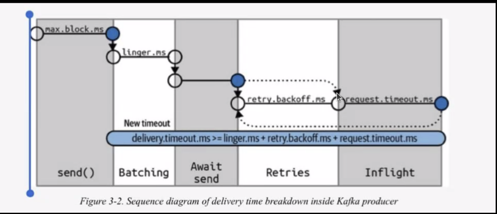

# kafka-training
Java based training in order to learn about Kafka

# Concepts
* batch: (batch of messages)
* schema: how messages are stored in Kafka
* topic: the place where messages are stored (similar to a table in db)
* partitions: (of topics)
* broker: a kafka instance (a machine were kafka is running)
* cluster: one or more brokers working as a single unit

# Requirements:
- jdk11
- [kafka binaries](https://kafka.apache.org/downloads) 
- [kafdrop](https://github.com/obsidiandynamics/kafdrop) (not necessary but useful)

# Installation & configuration
## Kafka installation
Simply unzip the `kafka binaries` and make sure you have the `jdk11` installed and properly configured.

## Kafka configuration
Go to the folder where you unzipped Kafka binaries and modify the following files:
```
- config/zookeeper.properties
- config/server.properties
```
In the `zookeeper` file specify a `clientPort` and make sure you set the flag `admin.enableServer` to `true` (don't forget to specify a `serverPort`).

In the `server` file make sure the `zookeeper.connect` matches the `clientPort` defined in the **zookeeper** file.

## Run kafka and zookeeper
Once we are done with the the conf files, run:
```
bin/zookeeper-server-start.sh config/zookeeper.properties
bin/kafka-server-start.sh config/server.properties
```

Now you can go to http://localhost:8080/

## Kafdrop
Download the newest .jar from its repository and modify the `kafdrop.sh` file to your own needs (in this case it will be listening at the `9092` and the client will be accessible via the `9009` port).

To run the kafdrop client simply execute:
```
sh kafdrop.sh
```
and proceed to http://localhost:9009/

# Playing with Kafka
## Topics:
```
bin/kafka-topics.sh --bootstrap-server localhost:9092 --create --topic topic1
bin/kafka-topics.sh --bootstrap-server localhost:9092 --list

bin/kafka-topics.sh --bootstrap-server localhost:9092 --create --topic topic2 --partitions 3

# View topic details
bin/kafka-topics.sh --bootstrap-server localhost:9092 --describe --topic topic2

# Create topic with replication
bin/kafka-topics.sh --bootstrap-server localhost:9092 --create --topic topic3 --partitions 2 --replication-factor 1
```

## Publishing:
```
bin/kafka-console-producer.sh --bootstrap-server localhost:9092 --topic topic1

# with keys (assuming the separator is the ":" character)
bin/kafka-console-producer.sh --bootstrap-server localhost:9092 --topic topic2 --property parse.key=true --property key.separator=":"

>key1:aaaa
>key2:bbbbb
>key1:AAAA
```

## Consuming messages:
```
bin/kafka-console-consumer.sh --bootstrap-server localhost:9092 --topic topic2 --from-beginning
```

## Stopping kafka and zookeeper services:
```
bin/kafka-server-stop.sh
bin/zookeeper-server-stop.sh
```
----
# 2nd session: Producers
This session is about producers:
- basic producer (sync type: it sends a message and waits until it is received by the broker)
- async (the message is sent, and we can configure the producer to not waiting the ACK)

When publishing messages the flow is as follows:


Inside the `code/2` you'll find some producers, each representing a different scenario:
| Producer                  | Notes                                                                                                             |
|---------------------------|-------------------------------------------------------------------------------------------------------------------|
|  BasicProducer            | Producer with simple message                                                                                      |
|  BasicHeaderProducer      | Producer with simple message and headers                                                                          |
|  AsyncProducer            | Async producer with simple message                                                                                |
|  AckProducer              | Producer with simple message specifying the ACK method                                                            |
|  CustomSerializerProducer | Producer with custom serializer                                                                                   |
|  InterceptorProducer      | Producer with custom interceptor                                                                                  |
|  BatchProducer            | Producer with basic batch config (it waits 20 seconds before sending messages)                                    |
|  BatchProProducer         | Producer with batch config (it sends messages once one condition is met: max waiting time or batch size exceeded) |

## Quick notes 
- Kafka always assure you messages are received in the same order they ere sent.
- It is a good practice to **always** specify a `client.id` to allow tracing the messages (e.g.`ServiceName-Hostname`).
- Each `ACKS` value has it own purposes:
  - `1`: Waits until the broker confirms the message has arrived
  - `all`: Waits until server confirms message has arrived AT ALL replicas. It's the safest way but also the slowest.
  - `0`: Don't expect any confirmation. It's the fastest way.
- Usually an `interceptor` acts as a middleware executing at specific moments. You should NOT abuse interceptors because they can slow the message flow.
- Using `batches` can improve performance A LOT since it sends X messages at once, not one by one.
- When defining a producer you can configure the batch behavior: if there are more than 2 conditions (time or batch size),the batch will be sent once the first condition is met. 

----
# 3rd session